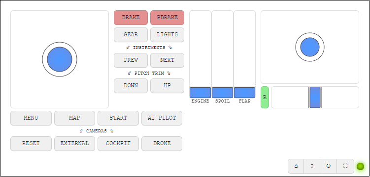
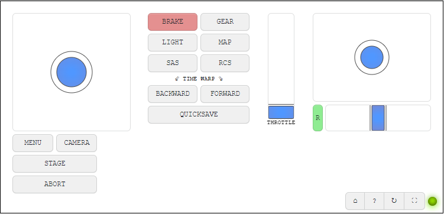

# Explanation
[uWebsockets](https://github.com/uNetworking/uWebSockets) C++ server communicates with [vJoy](https://github.com/njz3/vJoy) to emulate a virtual joystick over a websocket.

## Instructions for use
1. Download release from [releases section](https://github.com/FiendChain/VirtualJoystickCpp/releases)
2. Unzip the folder
3. Install <code>vJoySetup-*.exe</code>
4. Setup your controller by running <code>vJoyConf.exe</code> which was just installed
5. Start the server by running <code>main.exe</code>
6. Open http://localhost:3000 in your browser
7. Select a controller layout

## Example UI
### Microsoft Flight Simulator 2020

### Kerbal Space Program

### Changing UI
UI is written in native javascript and basic HTML. Use the existing webpages in <code>static/*.html</code> as a starting guide.

## Instructions for building
### Dependencies
- uWebsocket 20.11.0
- vJoy 2.2.1

### Build environment
- Visual Studio 2020
- C++17 compiler
- vcpkg 
- cmake

### Steps
1. Initialise your x64 C++ development environment by running <code>vcvars64.bat</code>
2. Run <code>fx cmake-conf</code>
3. Run <code>fx build release</code>
4. Run <code>build/Release/main.exe</code>
